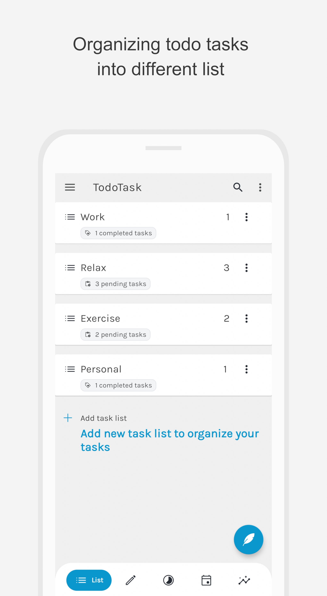
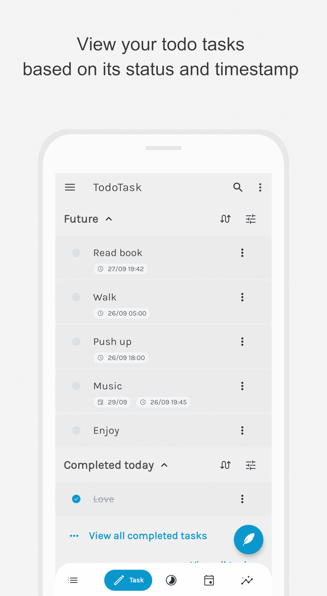
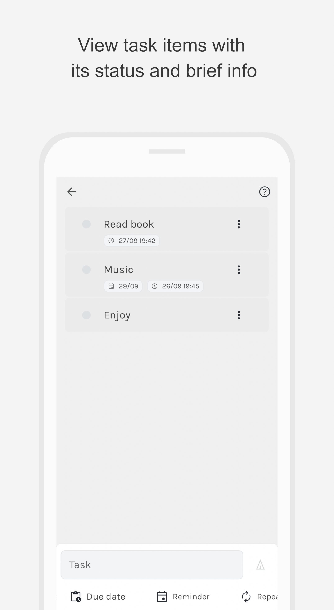

# UdoTask
A simple, friendly yet powerful to-do list. Task planner, tracker and reminder.
## Showcases

|||||
|:-----------------------:|:-----------------------:|:-----------------------:|:-----------------------:|
|||||

## Description
**Udo: To-Do list manager and planner** is a free and easy to-do list manager and schedule planner app which can be used to manage your tasks, take notes, record collections, plan an event, or set reminders to increase your productivity and focus on what matters to you.  
  
To do list task manager, as a todos productivity planner app, is dedicated to helping users track things to-do list, make daily planners free and provide important task reminders. Keep your life and work well organized.
  
Reasons for choosing this Todo-list
**Easy to use and beautiful user interface**  
The interface of the todolist application is friendly, simple and efficient. You can create to do tasks lists with an ease.  

**Udo: To-Do list manager and reminber** app provide a variety of theme colors to choose including dark theme. Make you feel more comfortable when managing todo-list and doing task trackers. Manage all your daily planners free.  
  
**Reminders with one-time or recurring due dates**  
Udo: To-Do list manager and reminber is a todo list and task planner reminder apps free for you. You can set task reminders with alarm for important todos to avoid forgetting.  
Support repeat to.do.list reminders. For recurring task lists, turn on recurring todo tasks’ reminders to simplify todo-list task managers.  
  
**Manage todos with task tracker categories, highlights and checklists**  
With the “Udo: To-Do list manager and reminber”, you can easily set to-do list categories, task list priorities, and todos’ stars to manage the todo lists and day planners efficiently  
You can star the todo list, making important things more outstanding  
Alsom you can add to-do-lists' sub-task lists, making all todos well organized.  
  
**Calendar view**  
“Udo: To-Do list manager and reminber” provides a to-do list calendar perspective. Make it easier for users to have a general view of daily schedule planners, weekly/monthly tasks planners and future day planners.  
  
**Tracking daily planners complete status, you are getting better.**  
Take some time to check the todo-list completion status of your daily planners on the "Profile" page. You will find that the days using todo-list task manager, you are getting better and better. 

**Task management features break your tasks into manageable steps**
The app allow you to break your tasks into multiple sub tasks with a simple and intuative meaningful

**Take notes to add to any task**
You can also add notes to your tasks to provide more description about the task to help with long term tasks. The task note support rich text editor, allow you to customize and highlight as much as you want.

**Group lists together by topic or category**
Group multiple tasks with similar purpose into a task list for more easy and managetable to-do lists. The task list will also provide the summary and status of its tasks to help you further in organizing your tasks

**Timeline View to see all your to-do tasks, checklists, notes, calendar events, reminders in one place.**
The app also include the timeline for viewing all your tasks in a choronoly order with a simple and friendly interface. You can also sort the list to see old tasks more easier.

**Full Screen reminder notifications with snooze & reschedule options.**
The notificaton support full screen reminder with snooze option and ringtone that can change as you like to help you customize your tasks further. With full screen reminder, you will easy to catch up with any importance events or tasks.

## How people use Udo:
  
⭐ Make a digital planner and timeline diary.  
⭐ Habit tracker with recurring tasks and reminders.  
⭐ To-Do list & Task Manager.  
⭐ Grocery list, shopping checklist template.  
⭐ Daily reminder to track work and plan meetings.  
⭐ Keep a health log with notes and tags.  
⭐ Make comprehensive work log.  
⭐ Daily diary and notes.  